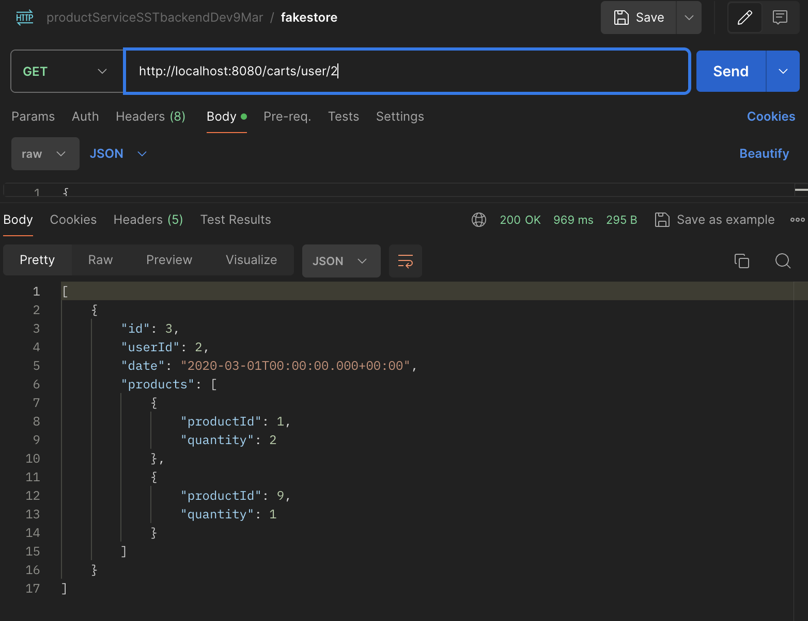
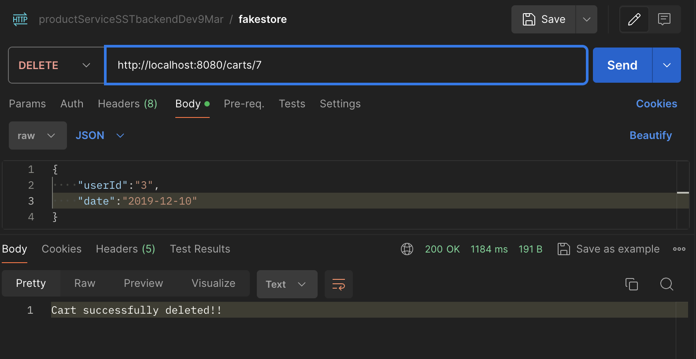

# REST API Proxy for Fakestore API

This simple REST API proxy serves as a bridge between your application and the Fakestore API, allowing seamless integration and manipulation of data.

## Features
- Proxy requests to the Fakestore API.
- Retrieve and manipulate data from the Fakestore API.

## Setup Instructions

1. **Clone the Repository:**

`git clone https://github.com/your/repository.git`

2. **Navigate to the Project Directory:**

`cd project-directory`

3. **Set Up Spring Boot Application:**
- Ensure you have Java and Maven installed on your system.
- Open the project in your preferred IDE.
- Run the application.

4. **Access the API:**
> Use your preferred REST client (e.g., Postman) to make requests to the following endpoints:
  - `GET /carts`: Retrieve a list of carts.
    
  - `GET /carts/{id}`: Retrieve details of a specific cart by ID.
    
  - `GET /carts/user/{id}`: Retrieve details of a specific cart by User ID.
    
  - `POST /carts`: Create a new Cart.
    
  - `PUT /carts/{id}`: Update an existing Cart.
    
  - `DELETE /carts/{id}`: Delete a Cart.
    

